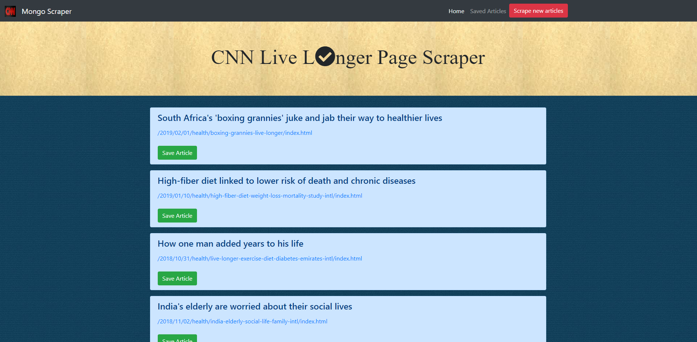
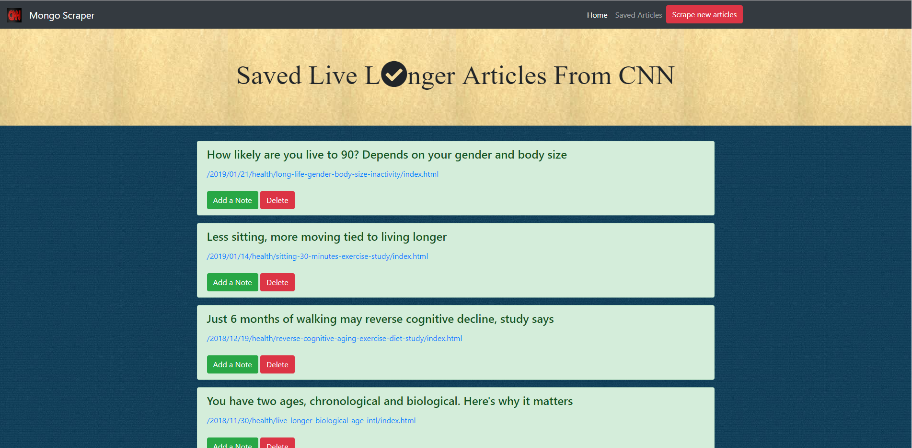
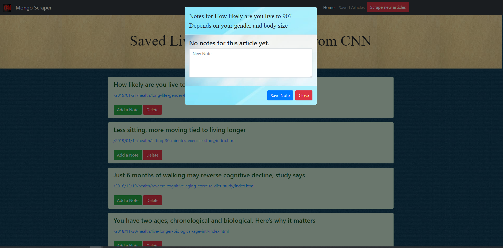
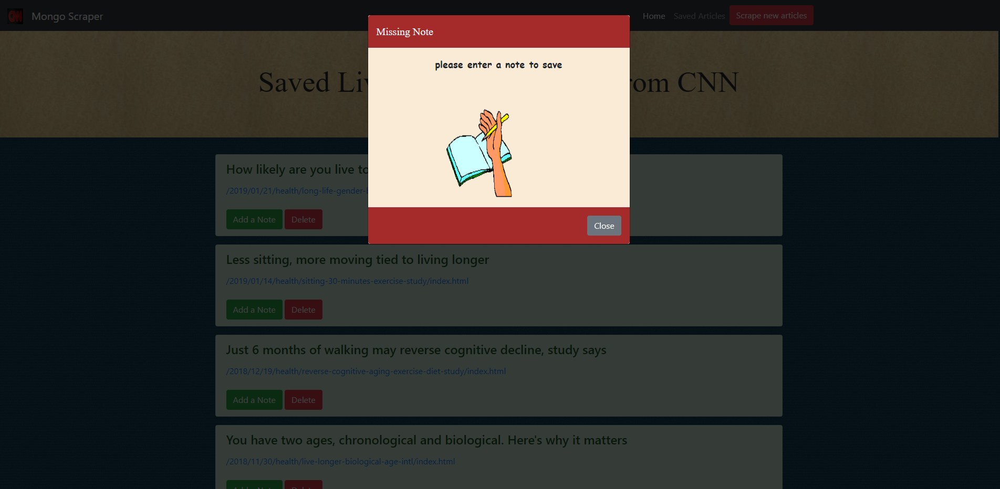

<h1>:newspaper:All the News That's Fit to Scrape</h1>

<h3>:mag_right:Overview</h3>

In this assignment, create a web app that lets users view and leave comments on the latest news. To get the articles, flex Mongoose and Cheerio muscles to scrape news from another site.

<h3>Tehcnologies Used</h3>
<ul>
<li>express</li>
<li>express-handlebars</li>
<li>mongoose</li>
<li>cheerio</li>
<li>axios</li>
<li>path</li>
<li>body-parser</li>
</ul>

<h3>:house:Home Page</h3>

<h3>:briefcase:Saved Articles</h3>

<h3>:green_book:Add a Note</h3>

<h3>:telescope:Save Note Button Validation</h3>

